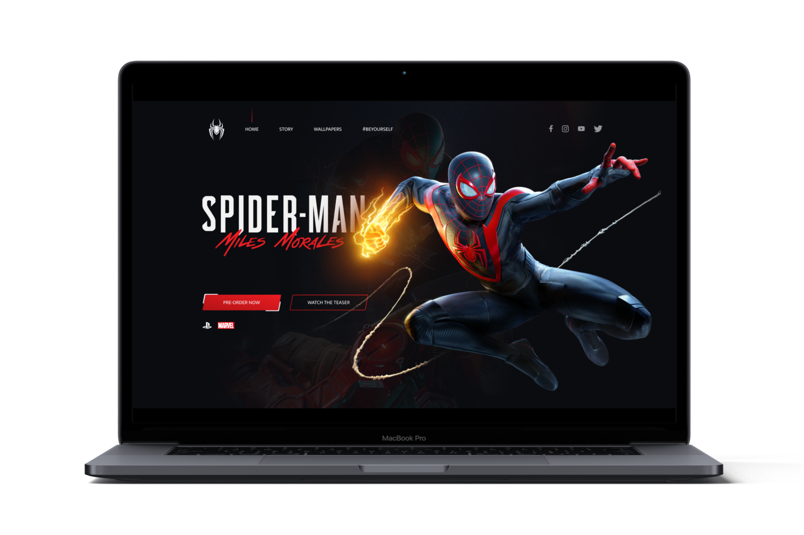

<h1 align="center">
    
    <br>
</h1>

<p align="center">
  <a href="https://www.linkedin.com/in/rafael-martins92/">
  
	</a>
  
  
  
  
  
  
  
  
</p>

<h4 align="center">
  <p>Spider-man: Miles Morales</p>
  
  <p>This application was developed during the FrontPush from Nasser Yousef.</p>

  <p>
  In this project we built an awesome landing page from the beginning. 

  We started by creating the Style Guide. After that we designed the UI Concept. And finally we developed the page using HTML, SASS and Javascript
  </p>
</h4>


<p align="center">
  <a href="#rocket-technologies">Technologies</a>&nbsp;&nbsp;&nbsp;|&nbsp;&nbsp;&nbsp;
  <a href="#information_source-how-to-use">How To Use</a>&nbsp;&nbsp;&nbsp;|&nbsp;&nbsp;&nbsp;
  <a href="#memo-license">License</a>
</p>

<p align="center">
  
</p>

## :rocket: Technologies

This project was developed with the following technologies:

-  [HTML](https://reactjs.org/docs/getting-started.html)
-  [SASS](https://reactnavigation.org/)
-  [JavaScript](https://kmagiera.github.io/react-native-gesture-handler/)
-  [GSAP](https://www.mongodb.com/)
-  [VS Code][vc] with [EditorConfig][vceditconfig] and [ESLint][vceslint]

## :eyes: Check it Out

You can try it here:

-  [Spider-man: Miles Morales][demo]

## :information_source: How to use

To clone and run this application, you'll need [Git](https://git-scm.com) installed on your computer. From your command line:

```bash
# Clone this repository
$ git clone https://github.com/rafaelmartins92/spiderman.git

# Go into the repository
$ cd spiderman

# Go to index.html
# Right click on it
# Run with Live Server
```

## :memo: License
This project is under the MIT license. See the [LICENSE](https://github.com/rafaelmartins92/spiderman/blob/master/LICENSE) for more information.

---

<h4 align="center">
    Made with ♥ by Rafael Martins 👋 <a href="https://www.linkedin.com/in/rafael-martins92/" target="_blank">Get in touch!</a>
</h4>

[vc]: https://code.visualstudio.com/
[vceditconfig]: https://marketplace.visualstudio.com/items?itemName=EditorConfig.EditorConfig
[vceslint]: https://marketplace.visualstudio.com/items?itemName=dbaeumer.vscode-eslint
[demo]: https://spiderman-rafaelmartins.netlify.app/
